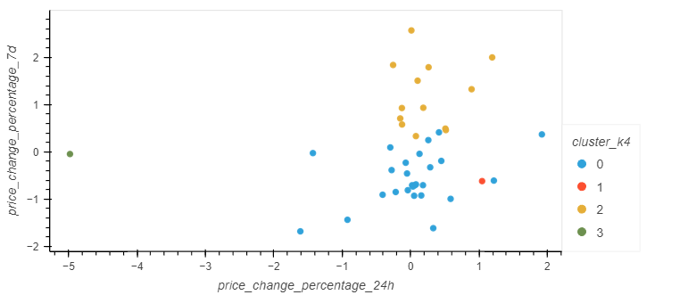

# Crypto Clustering

Using Clustering and PCA to analyze cryptocurrencies

#### Introduction

Using the unsuperviced techniques of K-means clustering and PCA followed by K-means to see if cryptocurrencies are affected by 24-hour or 7-day price changes. Overall, it was found that cryptocurrencies fall into 4 distinct clusters which can be further refined by usng PCA.

 

